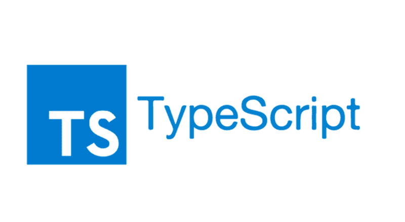

<h1 align="center">

</h1>

Here are some ideas to get you started:

- 📫 How to reach me: lkndrprjpt3@gmail.com
- 😄 Pronouns: Aaryan
- ⚡ Fun fact: <i style="font-weight: 600">Copy-and-Paste was programmed by programmers for programmers actually.</i>

<h3 align="center">A passionate frontend developer from India</h3>
 

  

<h2 align="center">Connect with me:</h2>

<h2 align="center" style="margin-top: 100">Languages and Tools</h2>
 

    
    
    
    
    
    
    
    
    

 
 

 
 
 

<!-- TODO: will open later -->
<!-- [(https://github-readme-stats.vercel.app/api?username=lokendra2500&layout=compact&hide=html&theme=tokyonight&count_private=true&show_icons=true)
] -->
 
<h1 align="center">Support</h1> 

  

